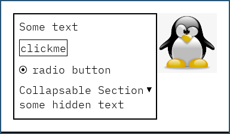

# Simple GUI

This is an attempt to create a simple widget based library in odin. I've never
done such a thing before, therefore, this library is more a playground than a
real usable library. The idea was more to try different things out and discover
`sdl3`, rather than creating an optimized tool.

The concept behind SGUI is that you can use functions to combine widgets and
create a UI the same way you would create a parser using a parser combinator
library. The default widgets are meant to be very simple, and therefore they
don't provide a lot of configuration. However, the simplicity makes writing new
widgets very easy. This is more an *"easy to rewrite as you need strategy"*
instead of having a super complex tool with a lot of options.

Note that the current version use 60 fps rendering which is not usually great
for desktop apps. A possible future improvement would be to only redraw widgets
that require to be redrawn. The *"widget hovering"* is also not fully
implemented right now (the current system is primitive and does not having
floating widgets).

## Example

```odin
example :: proc(ui: ^sgui.Ui) -> ^sgui.Widget {
    using widgets
    return hbox(
        vbox(
            text("Some text"),
            button("clickme", proc(ui: ^sgui.Ui, _: rawptr) { fmt.println("clicked!!!") }),
            radio_button("radio button"),
            collapsable_section("Collapsable Section",
                text("some hidden text"),
            ),
            attr = {
                props = {.FitH, .FitW},
                style = {
                    background_color = {255, 255, 255, 255},
                    border_thickness = 2,
                    active_borders = {.Top, .Bottom, .Left, .Right},
                    border_color = {0, 0, 0, 255},
                    padding = { 10, 10, 10, 10 },
                    items_spacing = 10,
                },
            }
        ),
        image("linux.png", 100, 100),
        attr = {
            props = {.FitH, .FitW},
            style = {
                background_color = {255, 255, 255, 255},
                padding = { 20, 20, 20, 20 },
            }
        }
    )
}
```



## The widgets

A widget contains the following informations:

```odin
Widget :: struct {
    x, y, w, h: f32,   // position and dimentions
    min_w, min_h: f32, // minimal dimensions used for resizable widgets
    z_index: u64,      // the z axis goes from the screen to the person in front of the screen
    disabled: bool,
    invisible: bool,
    focused: bool,
    children: [dynamic]^Widget,
    size_policy: SizePolicy,
    alignment_policy: AlignmentPolicy,

    /* procs */
    init: WidgetInitProc,       // initialize the widget (can be nil), setup the event handlers here
    destroy: WidgetDestroyProc, // destroy the widget (can be nil)
    update: WidgetUpdateProc,   // update the widget (can be nil)
    draw: WidgetDrawProc,       // draw the widget (required)
    resize: WidgetResizeProc,   // set the w and h (widow resize, or widget disabled) (can be nil)
    align: WidgetAlignProc,     // set the x and y (used by the layout widgets to align the children) (can be nil)
}
```

Custom widget:

```odin
MyWidget :: struct {
    using widget: sgui.Widget, // all the widget procs take a widget as argument
    ... // data of your widget
}


my_widget_draw :: proc(widget: ^sgui.Widget, ui: ^sgui.Ui) {
    self := cast(^MyWidget)widget
    sgui.draw_rect(ui, self.x, self.y, self.w, self.h, Color{255, 0, 0, 255})
    ...
}
```

### Convention

The widgets function should follow this convention:
- `my_widget`: constructor (used when building UI)
- `my_widget_<foo>`: example (`my_widget_draw`)

The following may change:

The last argument of the widget constructor is named `attr` and contains the
widget attributes (props, style, data, ...). SGUI currently uses a global
variable to set the default value:

```odin
my_widget :: proc(args..., attr := OPTS.my_widget_attr)
```

This way, each application can set the default values of the widgets at the
start so that all the widgets of the same type share the same properties. This
this is mainly useful for the "style" which might be separated from the
attributes in the future.

## Experimentations

Here are some design experimentations made in this project.

### Widget storage

SGUI doesn't allow to get any widgets from a specific id, however, it is
possible to store widgets manually to make them available globally. The key can
be either a string or an int (the two can be useful depending on the
situation). This is done to only save what needs to be saved and not fill a map
with useless values.

```odin
// store the pannel
ui->store("pannel", pannel_widget)
...
// get it back
pannel_widget := ui->widget("pannel")
// if you have a "toggle pannel button" you can hide the pannel like this
sgui.widget_toggle(pannel_widget, ui)
```

### Layers

One UI can store multiple roots. This can be used to create different menus
inside the same window.

### Draw queue

This is a weird component that may require a change. This is used to add a draw
function to a priority queue that will be processed after all the widgets are
drawn. This is currently used to draw widgets that have a positive z index, but
the main objective of this system is to allow the user to draw anything he wants
after the widgets are drawn (like floating pop ups, ...). This is an attempt to
give full control to the user instead of restricting him to a portion of the
screen (like in a `draw_box` widget for instance).
